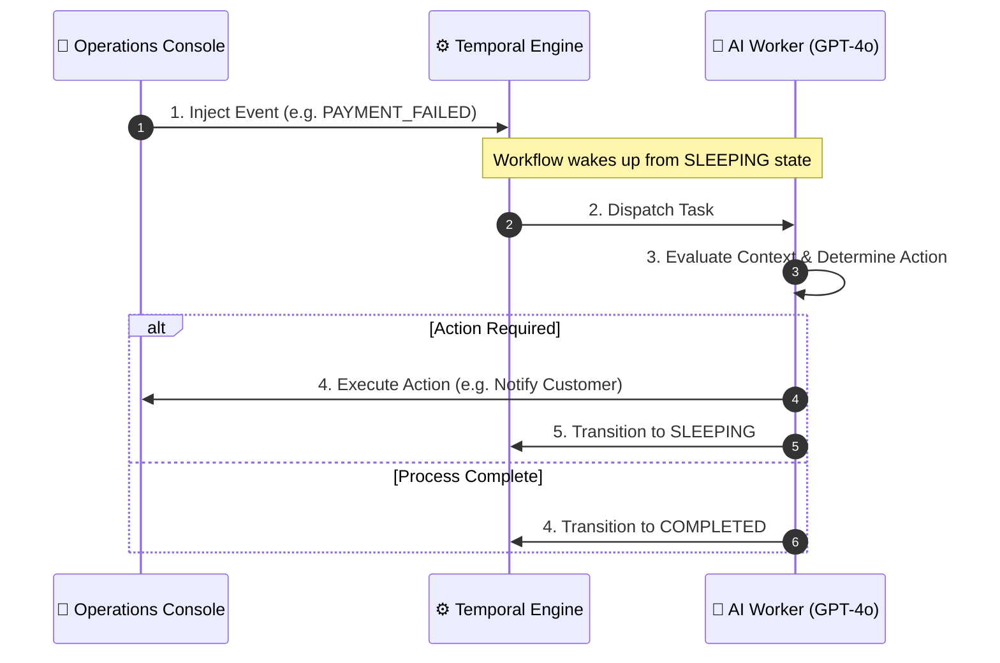
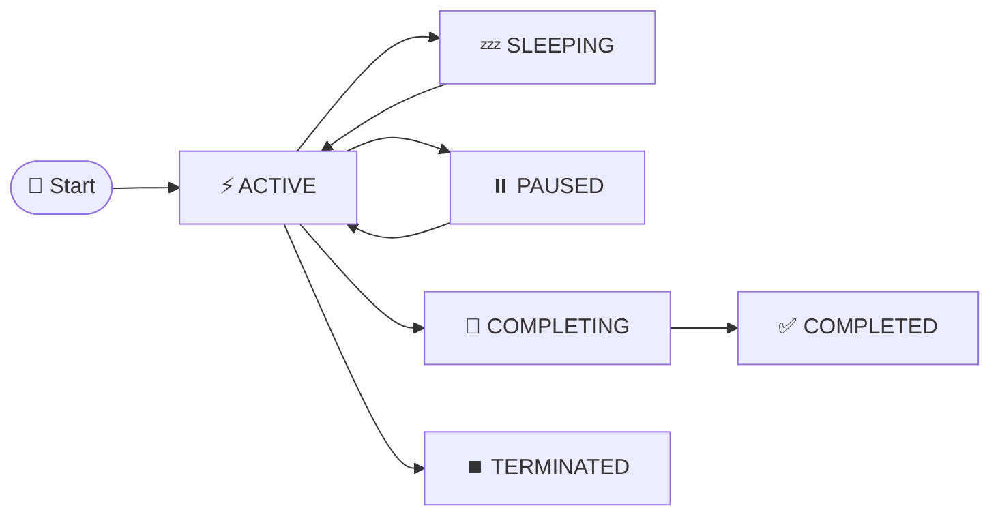

# 🛒 Order Supervisor — Intelligent AI Operations Platform

> A durable, event-driven AI agent supervisor system powered by **FastAPI**, **Temporal.io**, **PostgreSQL**, **Next.js**, and **OpenAI**. Designed for real-time observability, human-in-the-loop governance, and autonomous order lifecycle supervision.

---

## 🌟 Overview

The **Order Supervisor** is an enterprise-grade AI Operations Platform designed to manage, monitor, and govern e-commerce order lifecycles over long durations (days to weeks).

Unlike traditional short-lived chat agents, Order Supervisor runs **Durable AI Workflows** via Temporal.io. Each order is paired with an autonomous AI Supervisor that evaluates order events, triggers external actions (messaging logistics, notifying customers, creating notes), and dynamically sleeps or wakes up based on domain-specific policies.

---
## 🌟 Video Walkthrough
https://drive.google.com/file/d/15HB5TxwaFGVSRn8HLX1nw-GPe1Yr-4iV/view?usp=sharing

---

## 📐 System Architecture

### Component Architecture

The Order Supervisor is divided into distinct, easily understandable layers:

1. **🎨 User Interface (Next.js 15)**: The dashboard where operators monitor orders, view logs, and manually inject events or instructions.
2. **⚡ API Layer (FastAPI)**: A high-performance Python server that receives commands from the UI and translates them into Temporal workflow signals.
3. **⚙️ Orchestration (Temporal.io)**: The durable engine that guarantees workflows never lose state, even if the server crashes or the workflow sleeps for days.
4. **🧠 Intelligence (GPT-4o)**: The Temporal worker calls the LLM to make intelligent decisions based on the order's state and history.
5. **🗄️ Persistence (PostgreSQL)**: Stores the audit logs, compact memories, and supervisor configurations.

---

## 🔁 Event Processing & Execution Sequence

The sequence diagram below shows how an order event or instruction flows end-to-end through the system:



---

## 🔄 Workflow State Machine & Lifecycle

Every order execution follows a strict, durable state machine governed by Temporal:



### State Breakdown Table

| State | Type | Description |
| :--- | :--- | :--- |
| **`STARTING`** | Transient | Initializing run and connecting to Temporal workflow engine. |
| **`ACTIVE`** | Execution | AI Agent is currently analyzing events, executing LLM decisions, or recording activity. |
| **`SLEEPING`** | Wait State | Workflow is durably waiting for external signals or a timer, consuming 0 CPU resources. |
| **`PAUSED`** | Suspended | Execution manually paused by an operator. |
| **`INTERRUPTED`** | Suspended | Execution manually interrupted due to an alert or rule. |
| **`COMPLETING`** | Finalizing | Terminal event received; compiling final learnings and recommendations. |
| **`COMPLETED`** | Terminal | Order supervision lifecycle successfully finished. |
| **`TERMINATED`** | Terminal | Order workflow manually aborted by operator. |
| **`START_FAILED`**| Error | Failed to start Temporal workflow connection on initialization. |

---

## 🧩 Architectural Breakdown

### 1. User Interface Layer (`/frontend`)
- **Next.js 15 Console**: A modern dark-themed dashboard providing real-time visibility into supervisor runs.
- **Interactive Controls**: Allows operators to pause, resume, interrupt, or terminate workflows.
- **Event Simulator**: Enables 1-click simulation of e-commerce order lifecycle webhooks (`PAYMENT_FAILED`, `SHIPMENT_DELAYED`, `DELIVERED`).

### 2. API & Control Layer (`/backend/app/api`)
- **FastAPI REST API**: High-performance asynchronous routes for managing supervisors, launching workflow runs, and sending signals.
- **Auto-Synchronization**: Automatically detects when a workflow completes in Temporal and synchronizes the PostgreSQL state.

### 3. Persistence Layer (`/backend/app/db`)
- **PostgreSQL 16**: Relational storage for supervisor configurations, run states, activity logs, and compact memories.
- **SQLAlchemy 2.0 (Asyncpg)**: Asynchronous ORM providing audit logging and execution timelines.

### 4. Orchestration Engine (`/backend/app/temporal`)
- **Temporal.io Workflows**: Guarantees fault tolerance and state persistence across restarts, crashes, or network interruptions.
- **Durable Timers**: Allows agents to sleep for long durations without consuming server CPU or memory.

### 5. Intelligence Engine (`/backend/app/agent`)
- **OpenAI GPT-4o Engine**: Evaluates contextual prompts to decide next actions.
- **Fallback Engine**: Intelligent rule-based fallback provider used when API keys are absent, ensuring offline usability.

---

## 🛠️ Technology Stack

| Domain | Technology | Purpose |
| :--- | :--- | :--- |
| **Frontend** | Next.js 15, TypeScript, Tailwind CSS, Lucide React | Dark-themed AI Operations Console UI |
| **Backend API** | FastAPI, Python 3.11+, Pydantic v2 | High-performance asynchronous REST API |
| **Orchestration**| Temporal.io (Python SDK) | Fault-tolerant durable workflow & timer engine |
| **Database** | PostgreSQL 16, SQLAlchemy 2.0 (Asyncpg) | State storage, run history & audit logs |
| **AI / LLM** | OpenAI API (`gpt-4o`) & Rule-based Fallback | Autonomous decision-making & compact memory |
| **Containers** | Docker Compose | One-command orchestration of full stack |

---

## 🚀 Quickstart Guide

### Prerequisites
- [Docker & Docker Compose](https://docs.docker.com/get-docker/) installed.
- Node.js 18+ (if running frontend outside Docker).

### 1️⃣ Clone & Configure Environment

```bash
git clone https://github.com/SOHAMPAL23/Order-Supervisor.git
cd Order-Supervisor
```

Copy example environment configurations:
```bash
# Backend environment setup
cp backend/.env.example backend/.env

# Frontend environment setup
cp frontend/.env.example frontend/.env.local
```

*(Optional)* Set your OpenAI API key in `backend/.env`:
```env
OPENAI_API_KEY=sk-proj-your-actual-api-key
LLM_PROVIDER=openai
```
> **Note**: If `OPENAI_API_KEY` is not set, the system seamlessly uses the intelligent `FallbackLLMProvider` so you can test all workflows locally without an API key!

---

### 2️⃣ Start Services with Docker Compose

Run the complete backend stack (PostgreSQL, Temporal Server, Temporal Web UI, FastAPI Backend, and Temporal Worker):

```bash
cd backend
docker compose up -d
```

Check service status:
```bash
docker compose ps
```

---

### 3️⃣ Start the Frontend Console

Open a new terminal in the `frontend` directory:

```bash
cd frontend
npm install
npm run dev
```

Open [http://localhost:3000](http://localhost:3000) in your browser.

---

## 🌐 System Endpoints & Dashboards

| Service | URL | Description |
| :--- | :--- | :--- |
| **Frontend Console** | `http://localhost:3000` | AI Operations Console Dashboard |
| **FastAPI Swagger Docs** | `http://localhost:8000/docs` | Interactive API documentation |
| **Temporal Web UI** | `http://localhost:8080` | Temporal Workflow Observability |

---

## 📡 REST API Reference

### Supervisors
- `GET /api/supervisors`: List all supervisor profiles.
- `POST /api/supervisors`: Create a new supervisor configuration.
- `GET /api/supervisors/{id}`: Get specific supervisor details.

### Runs & Workflows
- `POST /api/runs`: Create and launch an Order Supervisor workflow.
- `GET /api/runs`: List all active and past runs.
- `GET /api/runs/{id}`: Get run status, context, and memory.
- `GET /api/runs/{id}/timeline`: Retrieve complete execution timeline.

### Human-in-the-loop Controls & Signals
- `POST /api/runs/{id}/events`: Inject an order event (e.g., `PAYMENT_FAILED`, `SHIPMENT_DELAYED`, `DELIVERED`).
- `POST /api/runs/{id}/instructions`: Inject human instructions into a running agent.
- `POST /api/runs/{id}/pause`: Pause an active workflow.
- `POST /api/runs/{id}/resume`: Resume a paused workflow.
- `POST /api/runs/{id}/terminate`: Terminate an active workflow.

---

## 💡 Operational Features & Best Practices

1. **Idempotency & Deduplication**: Events and actions are assigned unique UUIDs and tracked in the workflow memory to prevent duplicate processing.
2. **Auto-Synchronization**: If a Temporal workflow completes organically, subsequent REST API signals automatically detect completion and synchronize PostgreSQL state to `COMPLETED`.
3. **Compact Memory**: The AI supervisor updates a concise rolling summary after every decision to maintain context efficiency without exceeding token limits.
